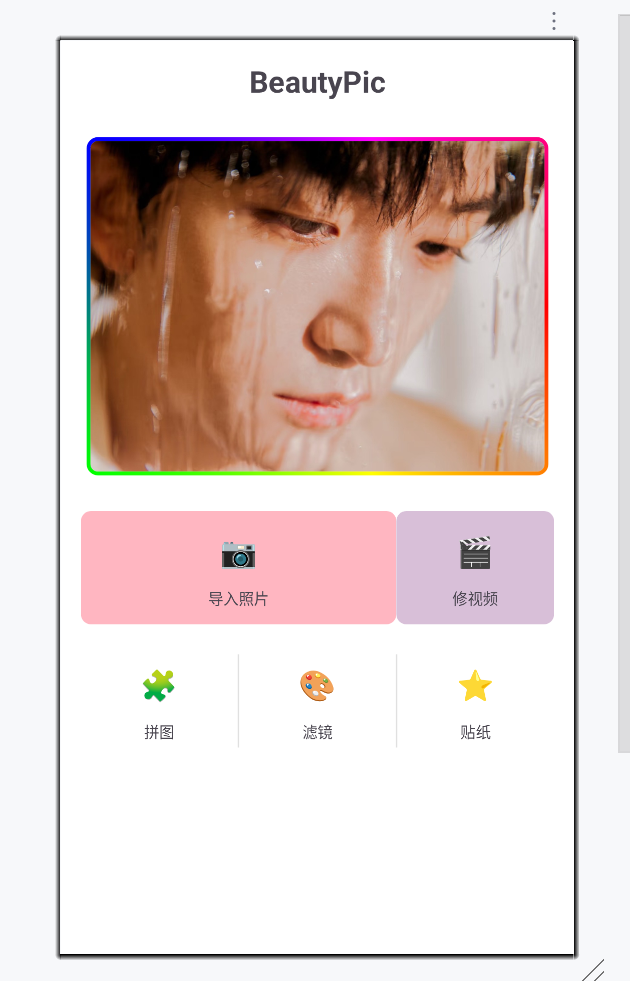
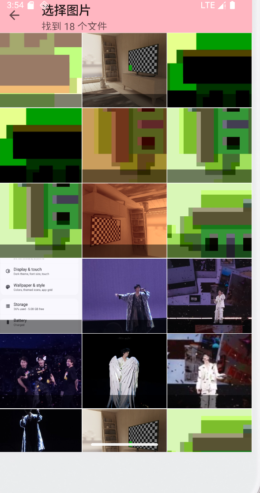
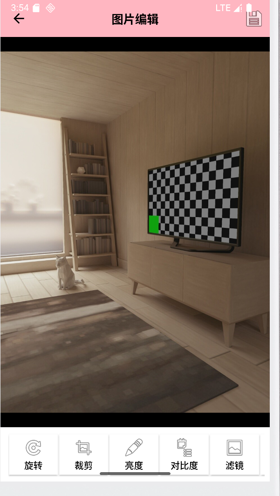
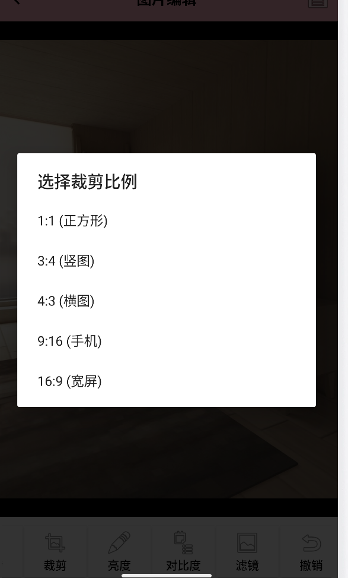
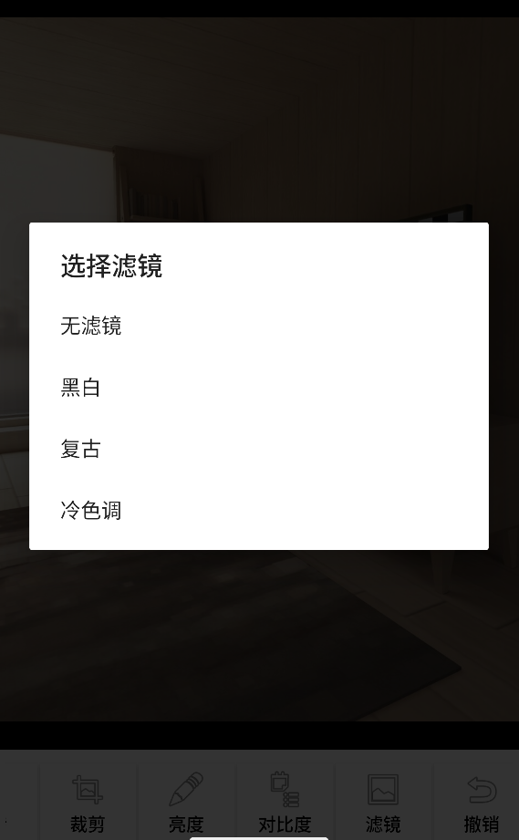
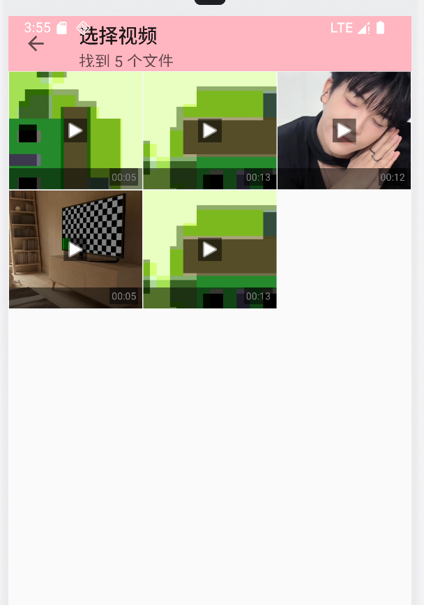
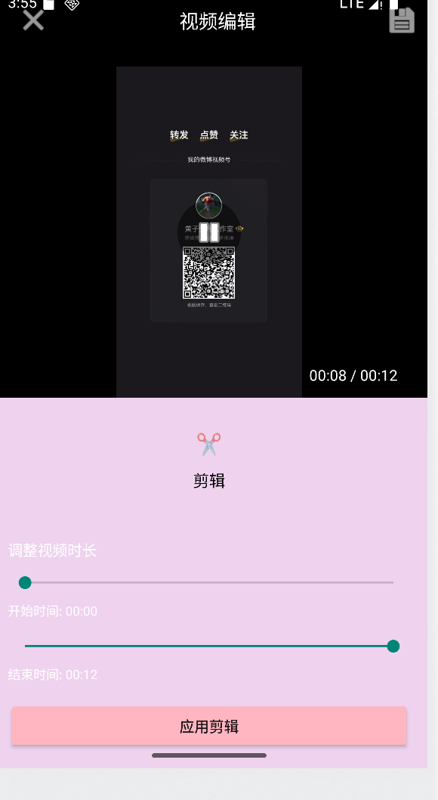

### BeautyPic - Android 图片视频编辑应用

BeautyPic 是一款功能全面的 Android 图片和视频编辑应用，采用现代化的 Material Design 界面设计，提供流畅的用户体验和专业的编辑功能。无论是日常照片美化还是短视频剪辑，BeautyPic 都能满足您的创作需求。

###### --核心功能--

**1.	图片编辑**

* 基础调整：旋转、裁剪、亮度、对比度调整
* 高级滤镜：黑白、复古、冷色调等多种艺术滤镜
* 实时预览：编辑效果即时可见，操作反馈迅速
* 撤销重做：支持多步操作撤销，编辑过程更灵活
* 高质量保存：优化压缩算法，平衡画质与文件大小

**2.	视频编辑**

* 智能剪辑：精确的时间轴选择，轻松裁剪视频片段
* 流畅播放：专业的视频播放引擎，支持多种格式
* 实时预览：剪辑效果即时预览，所见即所得
* 快速保存：高效处理并保存到相册

**3.	系统特性**

* 权限管理：智能的 Android 存储权限管理（适配 Android 13+）
* 媒体扫描：自动扫描并更新系统媒体库
* 性能优化：高效的资源管理和内存回收机制
* 响应式设计：适配不同屏幕尺寸和分辨率

###### --技术特性--

**开发语言：**Kotlin 100%

**架构设计：**模块化设计，易于维护和扩展

**核心框架：**

* Android Jetpack 组件
* OpenGL ES 2.0 图像渲染
* ExoPlayer 视频播放引擎
* 协程异步处理

**目标版本：**Android 8.0 (API 26) 及以上

###### --功能截图--

**1.	首页**

**2.	相册页**

**3.	图片编辑**

部分功能的展示如下

**4.	视频编辑**

###### --构建与运行说明--

**1.环境要求**

Android Studio：Arctic Fox (2020.3.1) 或更高版本

Android SDK：API 26 及以上

开发设备：Android 8.0 及以上版本的手机或平板

**2.构建步骤**

获取项目代码

通过版本控制工具克隆或下载项目源代码。

**3.导入项目**

打开 Android Studio，选择 "Open" 或 "Import Project"，导航到项目文件夹并选择，等待 Gradle 同步完成。

**4.配置项目**

确保已安装必要的 SDK 版本，检查项目的 build.gradle 配置，如有需要，更新依赖库版本。

**5.运行应用**

连接 Android 设备或启动模拟器，点击运行按钮或使用快捷键 Shift+F10，在设备上授权必要的存储权限，开始使用 BeautyPic 应用。

运行注意事项

首次运行可能需要较长时间下载依赖。确保设备已开启开发者选项和 USB 调试。应用需要存储权限才能访问相册和保存文件。

###### --使用指南--

**1.图片编辑流程**

在主界面点击"导入照片"，此时需要同意授权相册的访问权限。从相册中选择要编辑的图片，然后进入编辑界面。使用底部工具栏的各种编辑工具，编辑完成后点击保存按钮，编辑后的图片将保存到相册。

**2.视频编辑流程**

在主界面点击"修视频"，也需同意授权相册的访问权限。从相册中选择要编辑的视频，使用剪辑工具选择时间片段。拖动进度条实现剪辑，分别是“开始时间”和“结束时间”。应用剪辑并预览效果，保存编辑后的视频到相册。

**3.权限说明**

Android 13 及以上需要"照片和视频"权限。Android 12 及以下需要"存储"权限。权限将在首次使用时请求。

###### --常见问题--

* 应用无法访问相册：检查是否授予了存储权限，重启应用重新请求权限。
* 图片加载失败：检查图片格式是否支持（支持 JPG、PNG），确保图片文件未损坏。
* 视频无法播放：检查视频格式是否支持（支持 MP4），确保视频编码格式兼容。
* 保存失败：检查存储空间是否充足，确认是否有写入存储的权限。

###### --更新计划--

需要完善滤镜效果、贴纸、拼图和文字添加的功能，性能优化和稳定性改进。需要研究跨平台开发。

###### --联系方式--

如有任何问题或建议，请通过以下方式联系我们：

项目地址：https://github.com/SourXuanzi/PhototEditor-BeautyPic

邮箱：2505272625@qq.com

**感谢使用 BeautyPic！**

**让每一刻的精彩都得到完美呈现。**

